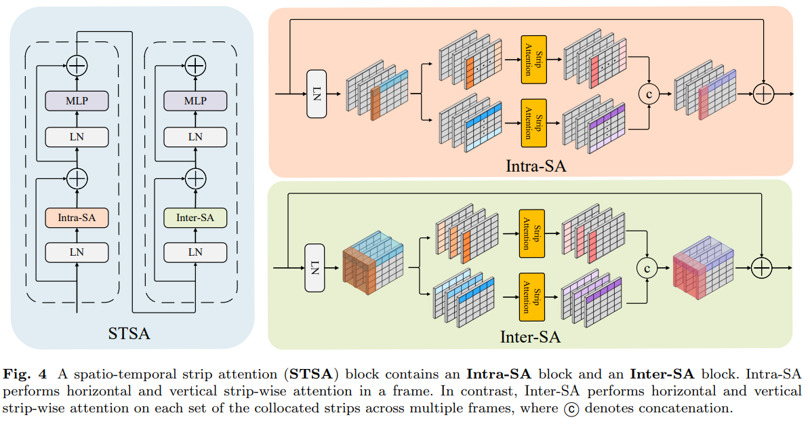

# ViStripformer (Video-Stripformer)
Pytorch Implementation of [ViStripformer: A Token-Efficient Transformer for
Versatile Video Restoration](https://arxiv.org/abs/2312.14502)




## Installation
```
git clone https://github.com/pp00704831/ViStripformer.git
cd ViStripformer
conda create -n ViStripformer python=3.7
source activate ViStripformer
conda install pytorch==1.8.0 torchvision==0.9.0 torchaudio==0.8.0 cudatoolkit=11.1 -c pytorch -c conda-forge
pip install opencv-python
pip install scipy
```
## Testing

Download the "[datasets](https://drive.google.com/drive/folders/1oR8oNE8VmntEOLcGbCFtWoxOJ5TnzvON?usp=drive_link)" and put them in './dataset'

**For Deblurring** </br>
* You can find the pre-trained weights for deblurring in "[Here](https://drive.google.com/drive/folders/1UDNPTsGrzhW40yqsH6cXBqwRABBv7x2K?usp=drive_link)" </br>
* Download the pre-trained weights for deblurring and put them into './weights/Deblur'
* Run the following command to reproduce our results 
```
python predict_Video_Stripformer_Plus_GoPro.py
```
```
python predict_Video_Stripformer_GoPro.py
```
```
python predict_Video_Stripformer_Plus_BSD.py
```
```
python predict_Video_Stripformer_BSD.py
```
**For Deraining** </br>
* You can find the pre-trained weights for deraining in "[Here](https://drive.google.com/drive/folders/1D_0YX4dVGGBWCLKoUZkkqSLFgXOotOh9?usp=drive_link)" </br>
* Download the pre-trained weights for deblurring and put them into './weights/Derain'
* Run the following command to reproduce our results 
```
python predict_Video_Stripformer_RainSynAll100.py
```
```
python predict_Video_Stripformer_Complex25.py
```
**For Demoireing** </br>
* You can find the pre-trained weights for deraining in "[Here](https://drive.google.com/drive/folders/17IMJphbG50uBOrqQJ2USZJLuyjVPa01t?usp=drive_link)" </br>
* Download the pre-trained weights for deblurring and put them into './weights/Demoireing'
* Run the following command to reproduce our results 
```
python predict_Video_Stripformer_TCL.py
```

## Evaluation
**For Deblurring** </br>
* Run the following command
```
python calculate_psnr_GoPro.py
```
```
python calculate_psnr_GoPro_Plus.py
```
```
python calculate_psnr_BSD.py
```
```
python calculate_psnr_BSD_Plus.py
```
**For Deraining** </br>
* Run the following command
```
python calculate_psnr_RainA100.py
```
```
python calculate_psnr_RainSynComplex25.py
```
**For Demoireing** </br>
* Run the following command
```
python calculate_psnr_TCL.py
```


